# Analysis of Byte-Level Topology of Text Corpus

This document provides an overview of the images generated by the `bytes_research.py` script. Each image visualizes a different aspect of the byte-level analysis of a text corpus.

## Comprehensive Analysis Plot

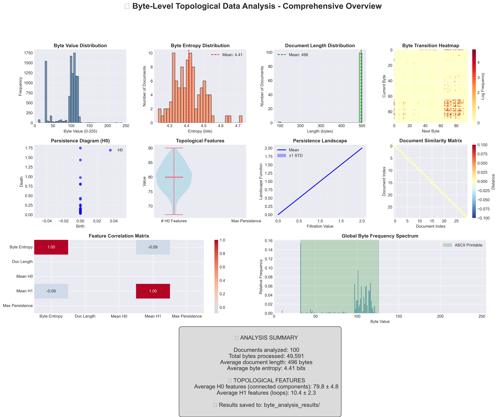

This is the main output of the analysis. It provides a comprehensive overview of all the different analyses performed on the text corpus. The subplots within this image are also saved as individual images and are described below.

## Byte Value Distribution

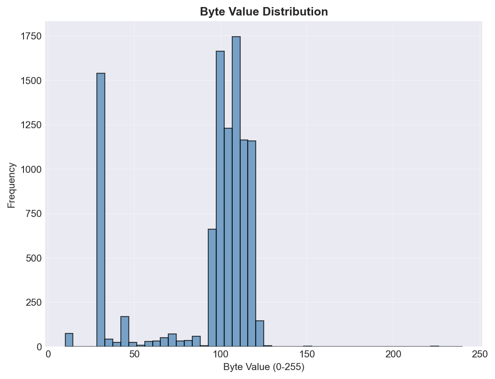

This histogram shows the distribution of byte values (0-255) across a sample of the documents. It helps to understand which byte values are more frequent in the text corpus. For example, a high frequency of bytes in the ASCII range (32-126) is expected for English text.

## Byte Entropy Distribution

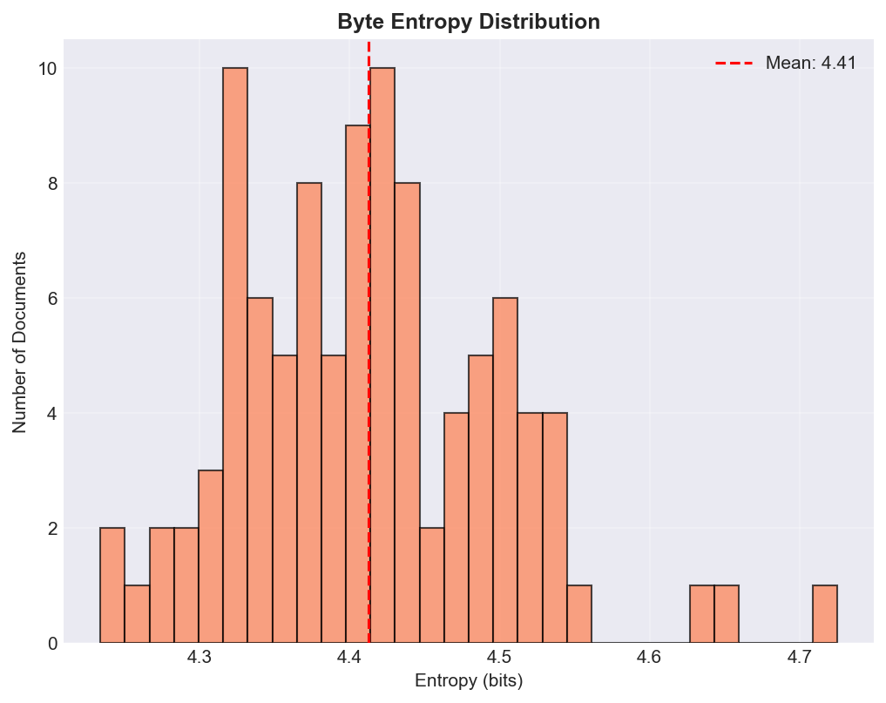

This histogram shows the distribution of byte entropy for each document in the corpus. Entropy is a measure of the randomness or diversity of byte values in a document. A higher entropy indicates a more diverse set of byte values, which could suggest more complex or compressed content. The red dashed line indicates the mean entropy across all documents.

## Document Length Distribution

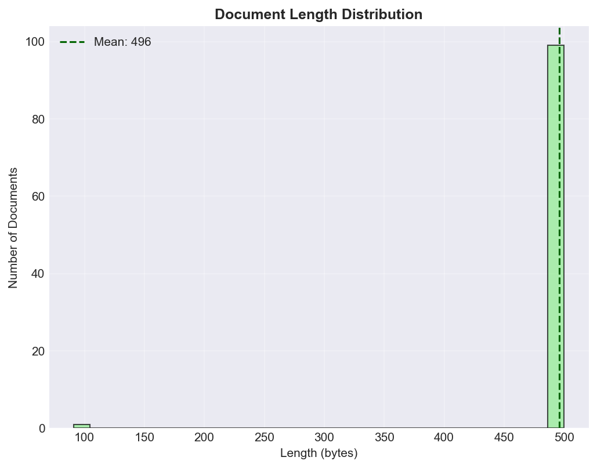

This histogram shows the distribution of document lengths in bytes. It provides an overview of the size of the documents in the corpus. The green dashed line indicates the mean document length.

## Byte Transition Heatmap

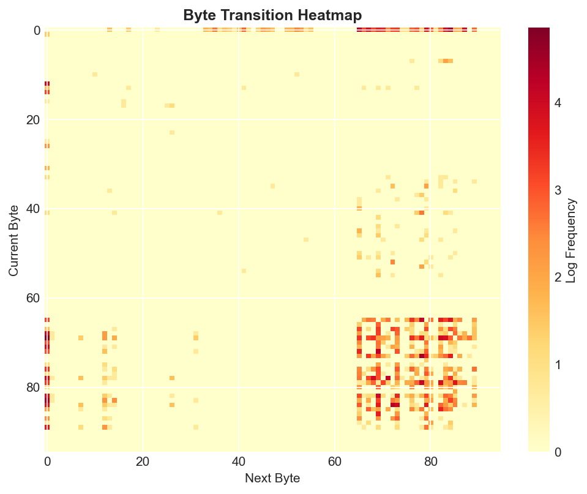

This heatmap visualizes the frequency of transitions between consecutive bytes in the text. The x-axis represents the next byte, and the y-axis represents the current byte. The color intensity indicates the frequency of a particular byte transition. This can reveal patterns in the byte sequences, such as common character pairings.

## Persistence Diagram Sample

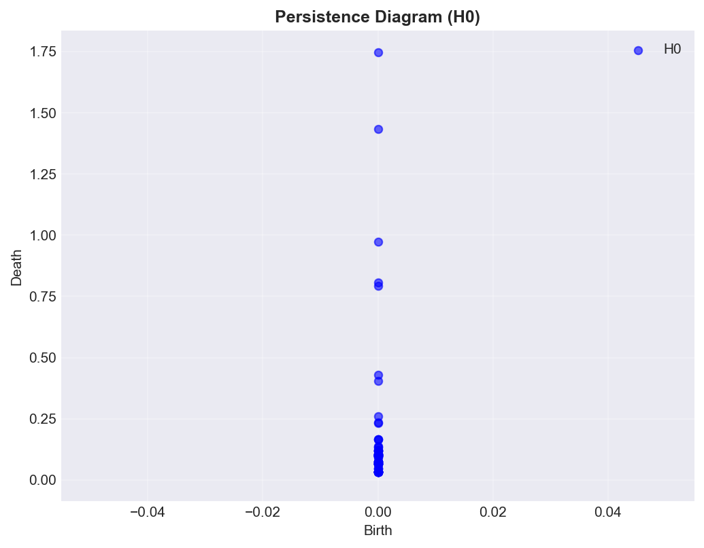

This is a persistence diagram for a single document. It is a plot of birth-death pairs of topological features (in this case, connected components, or H0). The x-axis is the birth time and the y-axis is the death time. The points far from the diagonal represent persistent features, which are significant topological structures in the data.

## Topological Features Violin Plot

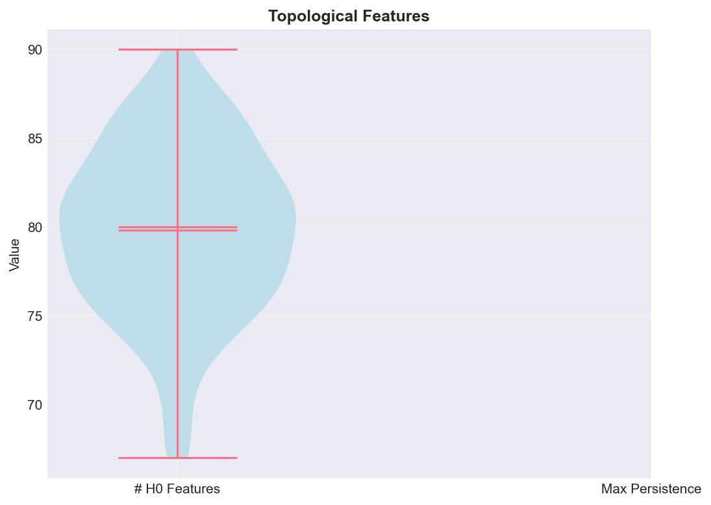

This violin plot shows the distribution of two topological features: the number of H0 features (connected components) and the maximum persistence of H0 features. The violin plot shows the density of the data at different values. The white dot is the median, the thick black bar in the center represents the interquartile range, and the thin black line represents the 95% confidence interval.

## Persistence Landscape

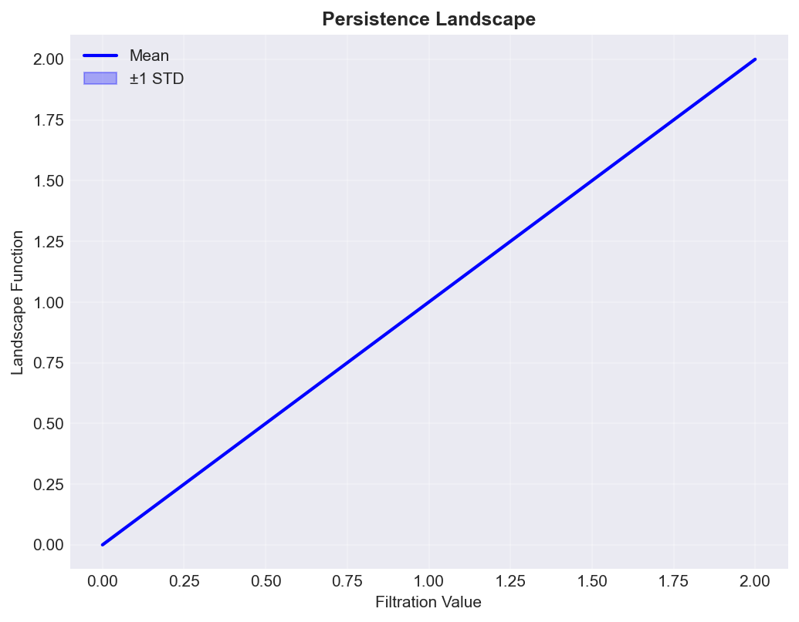

This plot shows the mean persistence landscape of the H0 features, with the standard deviation shown as a shaded area. The persistence landscape is a representation of the persistence diagram that is more suitable for machine learning tasks. The peaks in the landscape correspond to the most persistent features.

## Document Similarity Heatmap

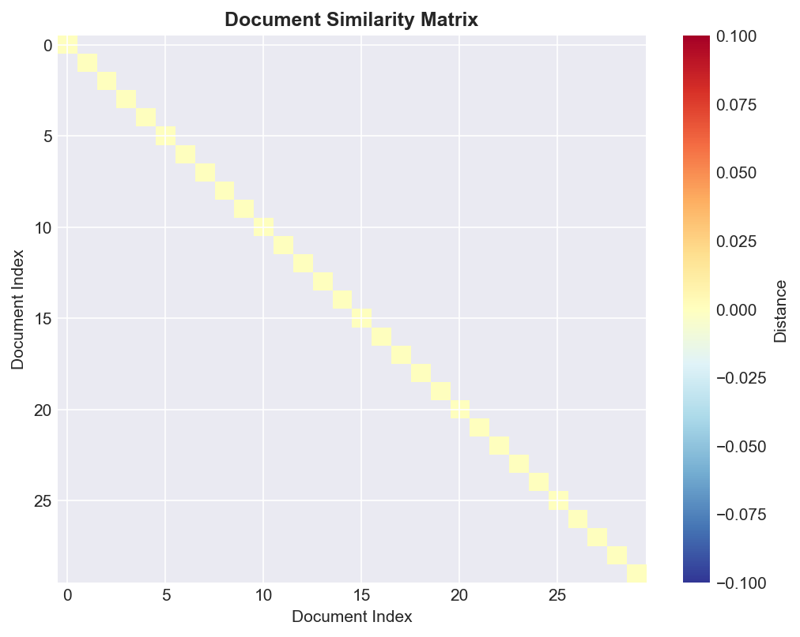

This heatmap shows the pairwise similarity between documents based on their topological features. The color of each cell represents the similarity between two documents, with darker colors indicating higher similarity. This can help to identify clusters of similar documents.

## Feature Correlation Heatmap

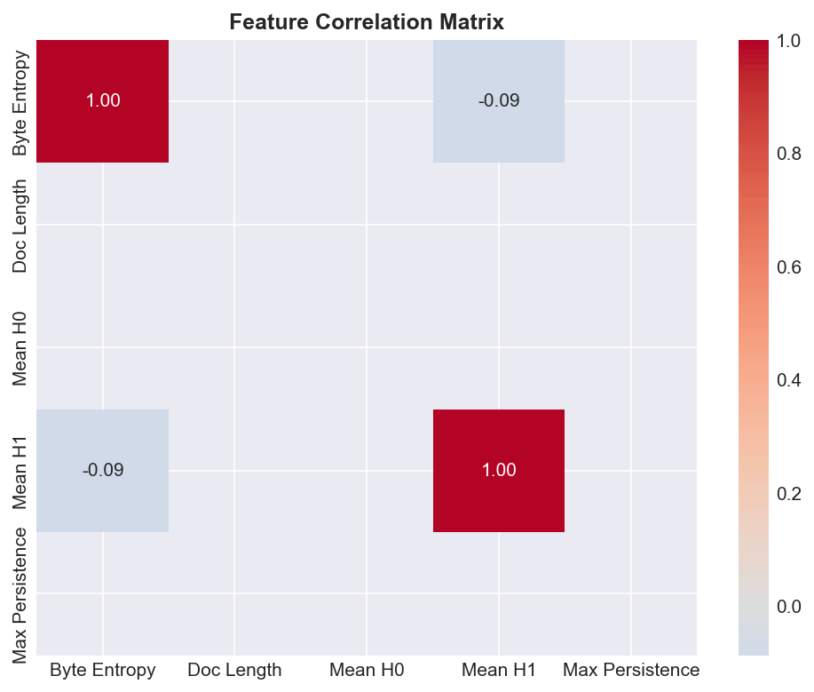

This heatmap shows the correlation between different features calculated from the documents. The features include byte entropy, document length, and various topological features. The color of each cell indicates the correlation between two features, with red indicating a positive correlation and blue indicating a negative correlation. This helps to understand the relationships between different features.

## Global Byte Frequency Spectrum

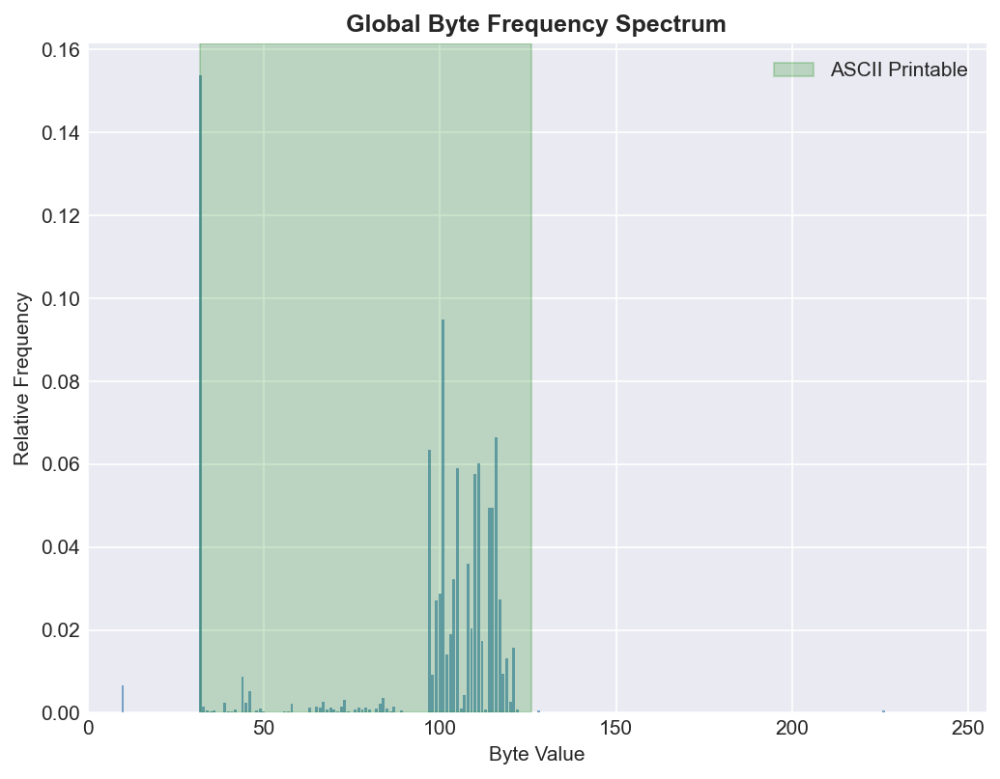

This bar chart shows the global frequency of each byte value across the entire corpus. It is similar to the byte value distribution, but it shows the relative frequency of each byte instead of the raw count. The green shaded area highlights the ASCII printable range.